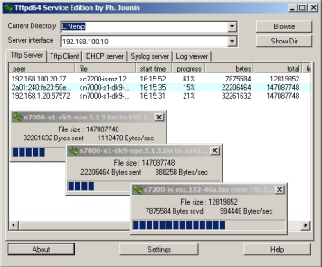
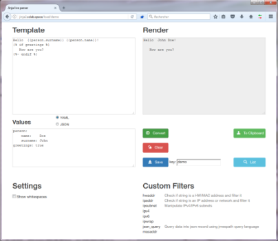
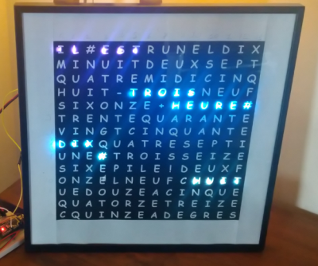

This is the home page for my open source projects.

You will find:

| project | description |
| --- | --- |
| [tftpd64](https://github.com/PJO2/tftpd64/) | this is my TFTP server, which has been downloaded more than 15 million times |
| [uweb](https://github.com/PJO2/uweb/) | A tiny multithreaded web server with immediate setup |  
| wordclocktwo | An home made word clock written for [arduino](https://github.com/PJO2/qclocktwo-arduino), [raspberry](https://github.com/PJO2/qclocktwo-python/) or [esp8266](https://github.com/PJO2/qclock-esp/) |
| [wanem](https://github.com/PJO2/wanem/) | a GUI to remotely manage the netem linux driver
| [jinja2-live](https://github.com/PJO2/jinja2-live/) | A jinja2 template tester |
| [weekly-cal](https://github.com/PJO2/weekly_cal/wiki/) | a guide (in french) to build an automation heating system using the domoticz framework and low cost wifi switches |
| Cheat sheets | Various cheat sheets for [linux](https://github.com/PJO2/cheat-sheet/blob/master/Unix%20redirection%20and%20pipe%20cheat%20sheet.pdf), [Z80](https://github.com/PJO2/cheat-sheet/blob/master/Z80%20CheatSheet.pdf) and [8086](https://github.com/PJO2/cheat-sheet/blob/master/8086%20cheat%20sheet.pdf) assemblers (Yes i'm so old school) and a [Jinja2's cheat sheet](https://github.com/PJO2/cheat-sheet/blob/master/Advanced_Jinja2.pdf) reviewed by Ivan Pepelnjak [here](https://blog.ipspace.net/2021/04/worth-reading-data-manipulation-jinja2.html) |

## other stuff

see my [network blog posts](http://mhd-experts.com/) (in french)

## About me

see [my linkedin page](https://www.linkedin.com/in/phjounin/)

## some projects

|     |     | 
| --- | --- | 
[  |  |
|    |  |
